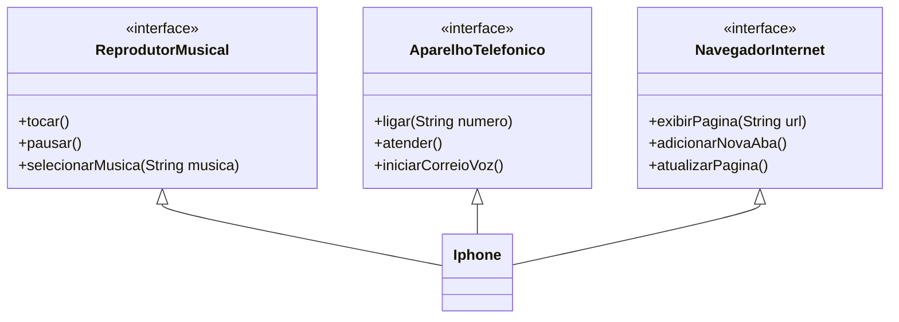

O projeto Java foi desenvolvido com base na modelagem do diagraama abaixo:

```mermaid
    classDiagram
        direction BT

        class ReprodutorMusical {
            <<interface>>
            +tocar()
            +pausar()
            +selecionarMusica(String musica)
        }

        class AparelhoTelefonico {
            <<interface>>
            +ligar(String numero)
            +atender()
            +iniciarCorreioVoz()
        }

        class NavegadorInternet {
            <<interface>>
            +exibirPagina(String url)
            +adicionarNovaAba()
            +atualizarPagina()
        }

        class Iphone

        Iphone --|> ReprodutorMusical
        Iphone --|> AparelhoTelefonico
        Iphone --|> NavegadorInternet
```